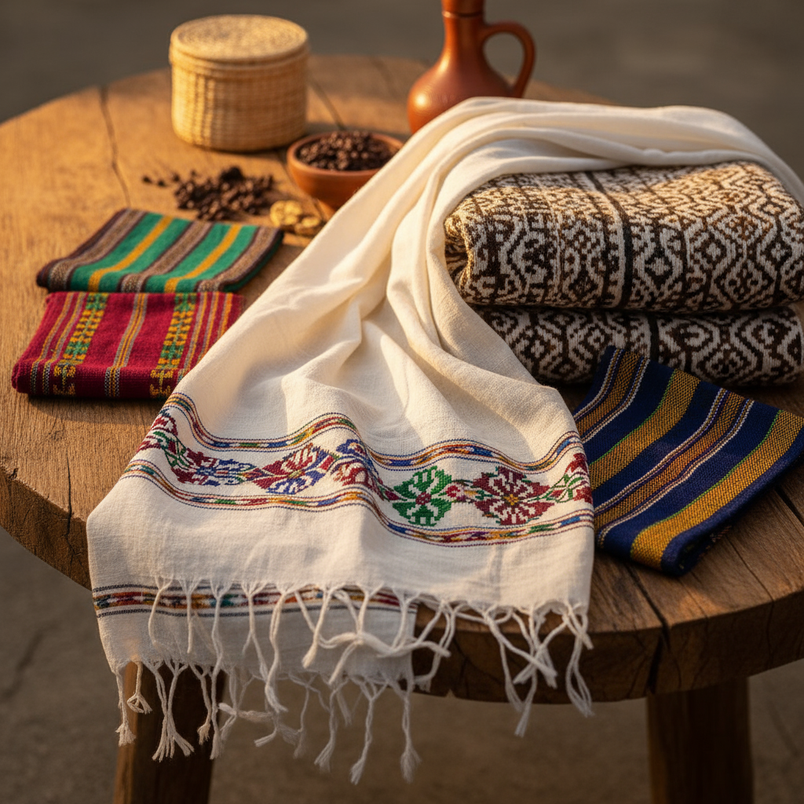

# Digital Market Cloth - Ethiopian Traditional Clothing E-commerce

A modern, culturally-inspired e-commerce platform dedicated to showcasing and selling authentic Ethiopian traditional textiles. This project was developed as a school project to demonstrate full-stack web development skills using PHP and SQLite.



## 🌟 Features

-   **Responsive Design:** A sleek, mobile-friendly interface with modern animations (Ken Burns effect, fade-ins).
-   **Multi-language Support:** Integrated support for **English** and **Amharic**, allowing users to browse in their preferred language.
-   **Cultural Heritage Section:** A dedicated "Culture" page exploring the history of Ethiopian weaving, from ancient origins to modern day.
-   **Shopping Experience:**
    -   Dynamic product catalog.
    -   AJAX-powered "Add to Cart" functionality.
    -   Secure checkout process.
    -   Order confirmation and tracking.
-   **Admin Dashboard:**
    -   Manage products (Add, Edit, Delete).
    -   Oversee user accounts and orders.
    -   View site analytics and performance.
-   **Secure Authentication:** User signup, login, and forgot password functionality.

## 🛠️ Tech Stack

-   **Frontend:** HTML5, CSS3 (Custom Vanilla CSS), JavaScript (Vanilla ES6).
-   **Backend:** PHP 8.x.
-   **Database:** SQLite (Lightweight, file-based database).
-   **Authentication:** Session-based user management.

## 🚀 Getting Started

### Prerequisites
-   PHP 8.0 or higher.
-   SQLite3 extension for PHP enabled.

### Installation
1.  **Clone the repository:**
    ```bash
    git clone https://github.com/hana897/digital_market_cloth.git
    cd digital_market_cloth
    ```

2.  **Initialize the Database:**
    Run the setup script to create the SQLite database and tables:
    ```bash
    php setup_sqlite.php
    ```

3.  **Run the Server:**
    You can use the built-in PHP server:
    ```bash
    php -S localhost:8000
    ```
    Open `http://localhost:8000` in your browser.

## 📁 Project Structure

-   `admin.php`: Main admin dashboard.
-   `culture.php`: Cultural heritage and history page.
-   `database/`: Contains database schema and connection logic.
-   `images/`: Product and UI assets.
-   `style.css`: Modern, custom styling for the entire platform.
-   `setup_sqlite.php`: Script to bootstrap the SQLite environment.

## 📜 License
This project is for educational purposes as a school project. All cultural content and image rights belong to their respective owners.
